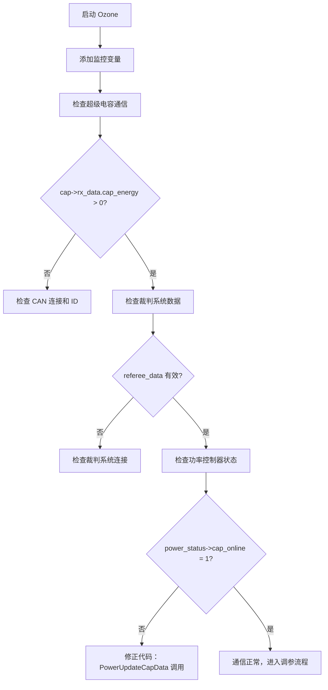

# Ozone 实时功率控制调试与调参指南

> **适用版本**: 底盘 LQR 力控策略 + RM2024 超级电容控制器
> **生成日期**: 2025-01-16
> **作者**: Claude (基于项目代码分析)

---

## 📋 目录

1. [系统架构概览](#系统架构概览)
2. [代码修正建议](#代码修正建议)
3. [Ozone 变量监控清单](#ozone-变量监控清单)
4. [实时图表配置](#实时图表配置)
5. [调参指南](#调参指南)
6. [常见问题排查](#常见问题排查)
7. [调试工作流程](#调试工作流程)

---

## 🏗️ 系统架构概览

### 功率控制系统结构

```
┌─────────────────────────────────────────────────────────────┐
│                      裁判系统 (CAN)                          │
│          功率限制 | 能量缓冲 | 实际功率                        │
└─────────────────────┬───────────────────────────────────────┘
                      │
                      ▼
┌─────────────────────────────────────────────────────────────┐
│              超级电容控制器 (CAN ID: 0x051/0x061)             │
│    接收: 功率限制, 能量缓冲 | 发送: 功率, 能量%, 错误码         │
└─────────────────────┬───────────────────────────────────────┘
                      │
                      ▼
┌─────────────────────────────────────────────────────────────┐
│                    功率控制器 (power_controller)              │
│  ┌──────────────┐  ┌──────────────┐  ┌──────────────┐      │
│  │  能量环(外环) │→│  功率环(内环) │→│  RLS参数辨识  │      │
│  │  PD控制器    │  │  智能分配    │  │  k1, k2更新  │      │
│  └──────────────┘  └──────────────┘  └──────────────┘      │
│         ↓                  ↓                                │
│    功率上下限        功率分配权重                             │
└─────────────────────┬───────────────────────────────────────┘
                      │
                      ▼
┌─────────────────────────────────────────────────────────────┐
│                    底盘力控策略 (chassis.c)                   │
│  速度控制 → 力控制 → 力转电流 → 功率限制 → 电机输出            │
└─────────────────────────────────────────────────────────────┘
```

### 关键参数流向

| 参数 | 来源 | 用途 | 更新频率 |
|------|------|------|---------|
| `chassis_power_limit` | 裁判系统 | 能量环输入 | 1kHz |
| `chassis_power_buffer` | 裁判系统 | 能量环输入 | 1kHz |
| `chassis_power` | 裁判系统 | RLS辨识 | 1kHz |
| `cap_energy` | 超级电容 | 能量环输入 | 1kHz |
| `cap_online` | 超级电容 | 能量源切换 | 1kHz |
| `k1, k2` | RLS辨识 | 功率预测 | 1-5ms |
| `max_power_limit` | 能量环 | 功率分配 | 1-5ms |

---

## ⚠️ 代码修正建议

### 必须修改：超级电容数据字段名称

**文件**: `Chassis/application/chassis/chassis.c`
**位置**: 第 704-706 行

**当前代码（错误）**:
```c
uint8_t cap_online = (cap && cap->can_ins->rx_len > 0) ? 1 : 0;
uint8_t cap_voltage = cap_online ? cap->cap_msg.vol : 0;  // ❌ 错误字段
PowerUpdateCapData(cap_voltage, cap_online);
```

**修改为（正确）**:
```c
// 获取超级电容数据
SuperCap_Rx_Data_s cap_data = {0};
uint8_t cap_online = 0;

if (cap && cap->can_ins) {
    cap_data = SuperCapGetData(cap);
    // 判断在线：检查接收长度 > 0 且数据有效
    cap_online = (cap->can_ins->rx_len > 0 && cap_data.cap_energy > 0) ? 1 : 0;
}

// 更新功率控制器
PowerUpdateCapData(cap_data.cap_energy, cap_online);
```

**理由**:
1. ✅ `cap_msg` 已被删除，替换为 `rx_data`
2. ✅ `vol` 字段已被删除，替换为 `cap_energy` (0-255，255=100%)
3. ✅ 使用 `SuperCapGetData()` 接口获取数据，符合封装原则
4. ✅ 添加数据有效性检查，避免误判在线状态

---

## 🔍 Ozone 变量监控清单

### **1. 超级电容通信监控（最高优先级）**

#### 核心变量

| 变量名 | 数据类型 | 正常范围 | 说明 |
|--------|---------|---------|------|
| `cap->rx_data.error_code` | `uint8_t` | 0 或 0x80 | 错误码（bit7=1表示输出关闭） |
| `cap->rx_data.chassis_power` | `float` | 0 ~ 300W | 底盘实际功率 |
| `cap->rx_data.chassis_power_limit` | `uint16_t` | 30 ~ 250W | 功率限制 |
| `cap->rx_data.cap_energy` | `uint8_t` | 0 ~ 255 | **电容能量百分比（255=100%）** |

#### 通信状态

| 变量名 | 数据类型 | 期望值 | 说明 |
|--------|---------|-------|------|
| `cap->can_ins->rx_len` | `uint16_t` | > 0 | CAN 接收数据长度（>0表示收到数据） |
| `cap->tx_data.enable_DCDC` | `uint8_t` (bit) | 1 | DCDC 使能标志 |
| `cap->tx_data.referee_power_limit` | `uint16_t` | 裁判系统值 | 发送给超级电容的功率限制 |
| `cap->tx_data.referee_energy_buffer` | `uint16_t` | 裁判系统值 | 发送给超级电容的能量缓冲区 |

**快速判断**：
```
✅ 通信正常: cap->rx_data.cap_energy 持续变化 (如 150→148→145...)
❌ 通信异常: cap->rx_data.cap_energy 始终为 0 或 255 且不变化
```

---

### **2. 功率控制器状态监控**

#### 获取状态指针（在 Watch 窗口中添加）

```c
const PowerControllerStatus_t *power_status = PowerGetStatus();
```

#### 关键状态变量

| 变量名 | 数据类型 | 正常范围 | 说明 |
|--------|---------|---------|------|
| `power_status->k1` | `float` | 0.1 ~ 0.5 | 转速损耗系数（RLS 实时更新） |
| `power_status->k2` | `float` | 0.5 ~ 2.0 | 力矩损耗系数（RLS 实时更新） |
| `power_status->max_power_limit` | `float` | 15 ~ 380W | **当前功率上限（核心输出）** |
| `power_status->power_upper` | `float` | 15 ~ 250W | 能量环计算的功率上限 |
| `power_status->power_lower` | `float` | 15 ~ 250W | 能量环计算的功率下限 |
| `power_status->estimated_power` | `float` | 0 ~ 300W | 估算功率消耗 |
| `power_status->sum_cmd_power` | `float` | 0 ~ 300W | 指令功率总和 |
| `power_status->energy_feedback` | `float` | 0 ~ 2100J | 能量反馈（电容或裁判系统） |
| `power_status->cap_online` | `uint8_t` | 0/1 | 电容在线标志 |
| `power_status->rls_enabled` | `uint8_t` | 0/1 | RLS 使能状态 |

**关键观察点**：
- **`max_power_limit`**: 实时功率限制，直接影响电机输出
- **`k1`, `k2`**: RLS 参数，收敛后应稳定在合理范围
- **`cap_online`**: 切换能量源（裁判系统 ↔ 超级电容）

---

### **3. 裁判系统数据监控**

| 变量名 | 数据类型 | 正常范围 | 说明 |
|--------|---------|---------|------|
| `referee_data->GameRobotState.chassis_power_limit` | `uint16_t` | 45/50/55/60/80/100/120 | 裁判系统功率限制 |
| `referee_data->PowerHeatData.buffer_energy` | `uint16_t` | 0 ~ 60J | 裁判系统能量缓冲区 |
| `referee_data->PowerHeatData.chassis_power` | `uint16_t` | 0 ~ 300W | 裁判系统实测功率 |

---

### **4. 电机功率对象监控（调试用）**

在功率限制时观察每个电机的功率分配：

```c
// 在 PowerGetLimitedOutput() 函数中设置断点
// 观察以下变量：
cmd_power[0~3]         // 每个电机的预测功率
weight_error           // 误差权重
weight_prop            // 比例权重
power_allocated        // 分配功率
max_torque            // 允许的最大转矩
```

---

## 📊 实时图表配置

### **Timeline Graph 1: 功率监控（核心）**

```
变量:
├─ power_status->estimated_power (红色实线)
├─ power_status->max_power_limit (蓝色虚线)
├─ referee_data->PowerHeatData.chassis_power (绿色实线)
└─ referee_data->GameRobotState.chassis_power_limit (黑色虚线)

Y 轴范围: 0 ~ 300W
采样周期: 1ms
```

**预期现象**:
- `estimated_power` 应始终 ≤ `max_power_limit`
- 功率超限时，`max_power_limit` 动态下降
- 能量充足时，`max_power_limit` 接近 `chassis_power_limit`

---

### **Timeline Graph 2: 能量状态监控**

```
变量:
├─ power_status->energy_feedback (蓝色)
├─ cap->rx_data.cap_energy (绿色) [缩放: ×8.235 显示为焦耳]
└─ referee_data->PowerHeatData.buffer_energy (橙色)

Y 轴范围: 0 ~ 2100J (左轴) / 0 ~ 255 (右轴)
采样周期: 10ms
```

**预期现象**:
- 电容在线时，`energy_feedback` ≈ `cap_energy × 8.235`
- 电容离线时，`energy_feedback` ≈ `buffer_energy`
- 能量降低时，功率限制随之降低

---

### **Timeline Graph 3: RLS 参数收敛**

```
变量:
├─ power_status->k1 (红色)
└─ power_status->k2 (蓝色)

Y 轴范围: 0 ~ 3.0
采样周期: 100ms
```

**预期现象**:
- 启动后 10-30 秒，`k1` 和 `k2` 逐渐收敛
- 收敛后小幅波动（±5%）属于正常
- 典型收敛值：`k1 ≈ 0.22`, `k2 ≈ 1.2`

---

### **Timeline Graph 4: 超级电容能量百分比**

```
变量:
└─ cap->rx_data.cap_energy (绿色)

Y 轴范围: 0 ~ 255
采样周期: 10ms

添加参考线:
├─ 255 (100% 满电)
├─ 192 (75%)
├─ 128 (50%)
└─ 64  (25%)
```

**预期现象**:
- 加速时能量下降
- 减速/静止时能量回升
- 低于 64 (25%) 时应触发功率限制

---

## 🔧 调参指南

### **1. 能量环 PD 控制器调参**

**文件**: `Chassis/modules/power_controller/power_controller.h`
**位置**: 第 23-25 行

```c
#define POWER_PD_KP 50.0f   // 比例增益
#define POWER_PD_KD 0.2f    // 微分增益
```

#### 调参步骤

| 参数 | 初始值 | 调整方向 | 现象 | 建议值 |
|------|-------|---------|------|-------|
| `POWER_PD_KP` | 50.0 | **太大** | 功率限制振荡，能量波动大 | 降低至 30-40 |
| `POWER_PD_KP` | 50.0 | **太小** | 响应慢，能量降低时功率限制不及时 | 提高至 60-80 |
| `POWER_PD_KD` | 0.2 | **太大** | 对能量变化过度敏感，抖动 | 降低至 0.1 |
| `POWER_PD_KD` | 0.2 | **太小** | 能量快速下降时反应慢 | 提高至 0.3-0.5 |

#### Ozone 调试方法

1. **在 Watch 窗口中添加**:
   ```
   power_status->energy_feedback
   power_status->max_power_limit
   ```

2. **操作测试**:
   - 全速前进 3 秒 → 观察能量下降速度
   - 急停 → 观察功率限制是否快速下降
   - 静止 → 观察能量是否回升

3. **调整判断**:
   ```
   ✅ 良好: 能量降至 25% 时，max_power_limit 降至 15-30W
   ❌ 过激: 功率限制频繁大幅波动 (>50W/s)
   ❌ 迟钝: 能量降至 10% 时，功率限制仍 >50W
   ```

---

### **2. 功率分配阈值调参**

**文件**: `Chassis/modules/power_controller/power_controller.h`
**位置**: 第 28-29 行

```c
#define ERROR_POWER_DISTRIBUTION_THRESHOLD 20.0f  // 误差分配阈值上限
#define PROP_POWER_DISTRIBUTION_THRESHOLD 15.0f   // 误差分配阈值下限
```

#### 参数含义

| 参数 | 含义 | 调整影响 |
|------|------|---------|
| `ERROR_POWER_DISTRIBUTION_THRESHOLD` | 速度误差总和 > 此值时，完全按误差分配功率 | 控制**启动加速**时的功率分配策略 |
| `PROP_POWER_DISTRIBUTION_THRESHOLD` | 速度误差总和 < 此值时，完全按比例分配功率 | 控制**匀速/微调**时的功率分配策略 |

#### 调参场景

**场景1：启动加速慢**
```
现象: 机器人启动时加速明显慢于预期
原因: 误差分配过于保守
调整: 降低 ERROR_POWER_DISTRIBUTION_THRESHOLD (20.0 → 15.0)
```

**场景2：匀速时抖动**
```
现象: 匀速行驶时底盘轮速不稳定
原因: 误差分配在匀速时仍占主导
调整: 提高 PROP_POWER_DISTRIBUTION_THRESHOLD (15.0 → 18.0)
```

---

### **3. 电容和裁判系统阈值调参**

**文件**: `Chassis/modules/power_controller/power_controller.h`
**位置**: 第 31-37 行

```c
#define REFEREE_FULL_BUFF 60.0f       // 裁判系统满能量阈值
#define REFEREE_BASE_BUFF 50.0f       // 裁判系统基准能量阈值
#define CAP_FULL_BUFF 230.0f          // 电容满能量阈值 (约 90%)
#define CAP_BASE_BUFF 30.0f           // 电容基准能量阈值 (约 12%)
#define MAX_CAP_POWER_OUT 300.0f      // 电容最大功率输出
#define CAP_OFFLINE_THRESHOLD 43.0f   // 电容离线阈值（未使用）
```

#### 调参建议

| 参数 | 典型值 | 调整建议 | 风险 |
|------|-------|---------|------|
| `CAP_FULL_BUFF` | 230 (90%) | **提高** → 更保守，提前降功率 | 过高会浪费电容能量 |
| `CAP_FULL_BUFF` | 230 (90%) | **降低** → 更激进，充分利用电容 | 过低可能导致电容过放 |
| `CAP_BASE_BUFF` | 30 (12%) | **提高** → 避免电容过放 | 功率限制启动更早 |
| `MAX_CAP_POWER_OUT` | 300W | **提高** → 爆发功率更强 | 需确认电容控制器支持 |

**⚠️ 警告**:
- `CAP_BASE_BUFF` 不应低于 25 (10%)，避免电容过放损坏
- `MAX_CAP_POWER_OUT` 应与超级电容控制器额定功率一致

---

### **4. RLS 参数辨识调参**

**文件**: `Chassis/application/chassis/chassis.c`
**位置**: 第 227-234 行

```c
PowerControllerConfig_t power_config = {
    .k1_init = 0.22f,                  // 转速损耗系数初始值
    .k2_init = 1.2f,                   // 力矩损耗系数初始值
    .k3 = 2.78f,                       // 静态功率损耗
    .rls_lambda = 0.9999f,             // RLS遗忘因子
    .torque_constant = 0.3f,           // M3508电机转矩常数
    .current_scale = 20.0f / 16384.0f, // CAN指令值转电流系数
};
```

#### RLS 遗忘因子调参

| 参数 | 典型值 | 调整影响 | 建议范围 |
|------|-------|---------|---------|
| `rls_lambda` | 0.9999 | **接近 1** → 收敛慢，稳定性高 | 0.999 ~ 0.99999 |
| `rls_lambda` | 0.9999 | **远离 1** → 收敛快，但易受噪声干扰 | - |

#### 调参步骤

1. **查看 RLS 收敛速度**:
   ```
   Timeline: power_status->k1, power_status->k2
   期望: 10-30 秒内收敛
   ```

2. **调整策略**:
   ```
   收敛太慢 (>60秒): 降低 lambda (0.9999 → 0.999)
   参数波动大 (±10%): 提高 lambda (0.9999 → 0.99999)
   ```

3. **验证收敛质量**:
   ```
   ✅ 良好: k1 ≈ 0.15-0.30, k2 ≈ 0.8-1.5, 波动 < 5%
   ❌ 异常: k1 或 k2 持续增大/减小，无收敛趋势
   ```

---

### **5. 初始参数标定（重要）**

#### k1, k2 初始值标定方法

**步骤1：离线测试**
1. 在平地上，让机器人以恒定速度行驶（如 1 m/s）
2. 记录裁判系统实测功率 `P_real`
3. 计算初始 `k1`:
   ```
   k1_init = (P_real - P_static) / (4 × |ω_wheel|)
   其中: P_static ≈ 3W, ω_wheel ≈ 轮速 (rad/s)
   ```

**步骤2：在线调整**
1. 启用 RLS: `#define RLS_ENABLE 1`
2. 运行 30 秒后，在 Ozone 中读取:
   ```
   power_status->k1  → 作为新的 k1_init
   power_status->k2  → 作为新的 k2_init
   ```
3. 更新 `chassis.c` 中的配置

**典型参考值（M3508 电机）**:
```c
.k1_init = 0.22f,   // 转速损耗: 0.15 ~ 0.30
.k2_init = 1.2f,    // 力矩损耗: 0.8 ~ 1.5
.k3 = 2.78f,        // 静态损耗: 2.0 ~ 4.0
```

---

## 🐛 常见问题排查

### **问题1：超级电容数据始终为 0**

**排查步骤**:

1. **检查 CAN 通信**:
   ```
   Watch: cap->can_ins->rx_len
   ✅ 正常: > 0 (通常为 8)
   ❌ 异常: = 0 (未收到数据)
   ```

2. **检查 CAN ID 配置**:
   ```c
   // chassis.c:203-205
   .tx_id = 0x061,  // 确认为 0x061
   .rx_id = 0x051,  // 确认为 0x051
   ```

3. **检查超级电容上电**:
   - 检查超级电容控制器 LED 指示灯
   - 使用 CAN 分析仪监控总线数据

4. **检查代码修正**:
   - 确认已应用[代码修正建议](#代码修正建议)中的修改
   - 确认使用 `cap->rx_data.cap_energy` 而非 `cap->cap_msg.vol`

---

### **问题2：功率限制不生效**

**排查步骤**:

1. **检查功率控制器使能**:
   ```c
   // power_controller.h:20
   #define POWER_CONTROLLER_ENABLE 1  // 确认为 1
   ```

2. **检查功率限制计算**:
   ```
   Watch: power_status->max_power_limit
   ✅ 正常: 15 ~ 300W，动态变化
   ❌ 异常: 始终为 80W 或 0W
   ```

3. **检查能量反馈**:
   ```
   Watch: power_status->energy_feedback
   ✅ 正常: 0 ~ 2100J，随电容/缓冲区变化
   ❌ 异常: 始终为 0
   ```

4. **检查底盘调用**:
   在 `chassis.c:693-725` 中设置断点，确认:
   - `PowerUpdateRefereeData()` 被调用
   - `PowerUpdateCapData()` 被调用
   - `PowerGetLimitedOutput()` 被调用

---

### **问题3：RLS 参数不收敛**

**可能原因**:

| 现象 | 原因 | 解决方案 |
|------|------|---------|
| `k1`, `k2` 持续为初始值 | RLS 未使能 | 检查 `#define RLS_ENABLE 1` |
| `k1`, `k2` 剧烈波动 | 功率测量噪声大 | 提高 `rls_lambda` (0.9999 → 0.99999) |
| `k1` 或 `k2` 持续增大 | 功率模型不准确 | 检查电机参数 (`torque_constant`, `current_scale`) |
| `k1`, `k2` 收敛到异常值 | 初始值设置不当 | 使用标定方法重新设置 `k1_init`, `k2_init` |

**调试方法**:
```
1. 在 PowerRLSUpdate() 函数中设置断点
2. 观察:
   - measured_power: 裁判系统实测功率
   - effective_power: 有效功率（τω）
   - power_loss: 功率损耗
3. 验证: power_loss ≈ k1|ω| + k2τ² + k3
```

---

### **问题4：能量环控制过激或过钝**

**过激表现**:
- 能量轻微下降，功率限制立即大幅降低
- 功率限制频繁振荡 (>50W/s)

**解决方案**:
1. 降低 `POWER_PD_KP` (50.0 → 30.0)
2. 降低 `POWER_PD_KD` (0.2 → 0.1)

**过钝表现**:
- 能量降至 20%，功率限制仍未降低
- 响应延迟 >1 秒

**解决方案**:
1. 提高 `POWER_PD_KP` (50.0 → 70.0)
2. 提高 `POWER_PD_KD` (0.2 → 0.5)

---

## 🚀 调试工作流程

### **流程1：首次调试（验证通信）**



### **流程2：功率控制调参**

1. **阶段1：验证基础功能（10 分钟）**
   - [ ] 超级电容数据正常接收
   - [ ] 裁判系统数据正常接收
   - [ ] 功率控制器状态正常更新
   - [ ] RLS 使能后 `k1`, `k2` 开始变化

2. **阶段2：RLS 参数收敛（30 分钟）**
   - [ ] 启动机器人，匀速行驶 5 分钟
   - [ ] 观察 `k1`, `k2` 收敛曲线
   - [ ] 记录收敛后的稳定值
   - [ ] 更新 `k1_init`, `k2_init`

3. **阶段3：能量环调参（20 分钟）**
   - [ ] 全速前进，观察能量下降速度
   - [ ] 能量降至 50% 时，检查功率限制是否合理
   - [ ] 急停，观察功率限制响应速度
   - [ ] 根据现象调整 PD 参数

4. **阶段4：功率分配调优（20 分钟）**
   - [ ] S 型走位，观察各轮功率分配
   - [ ] 原地旋转，观察功率分配均衡性
   - [ ] 功率限制时，检查是否有轮子停转
   - [ ] 根据现象调整分配阈值

5. **阶段5：实战测试（30 分钟）**
   - [ ] 模拟比赛环境测试
   - [ ] 记录功率峰值和能量使用
   - [ ] 验证超级电容能量回收
   - [ ] 微调参数

---

## 📌 调参记录模板

建议在调参过程中记录以下信息：

```markdown
## 调参记录 - [日期]

### 初始参数
- k1_init: 0.22
- k2_init: 1.2
- POWER_PD_KP: 50.0
- POWER_PD_KD: 0.2

### RLS 收敛结果
- 收敛时间: 25 秒
- k1 稳定值: 0.235
- k2 稳定值: 1.15
- 波动范围: ±3%

### 能量环测试
- 满能量功率限制: 120W (裁判系统) + 300W (电容) = 420W
- 50% 能量功率限制: 80W
- 25% 能量功率限制: 30W
- 响应时间: <0.5s

### 功率分配测试
- 启动加速: 正常，四轮均匀
- 匀速行驶: 稳定，无抖动
- 急停: 功率立即降至 15W

### 问题和调整
1. 能量环响应过激 → 降低 KP 至 40.0
2. RLS 收敛慢 → 降低 lambda 至 0.999
3. 功率分配不均 → 调整阈值至 18.0/15.0

### 最终参数
- k1_init: 0.235
- k2_init: 1.15
- POWER_PD_KP: 40.0
- POWER_PD_KD: 0.2
- rls_lambda: 0.999
```

---

## 🎯 性能指标参考

### **良好性能标准**

| 指标 | 目标值 | 测量方法 |
|------|-------|---------|
| 功率限制响应时间 | < 0.5s | 能量降至阈值 → 功率限制生效 |
| RLS 参数收敛时间 | 10-30s | 启动 → k1/k2 波动 < 5% |
| 功率预测误差 | < 10% | `estimated_power` vs `chassis_power` |
| 能量利用率 | > 90% | 实际使用能量 / 可用能量 |
| 功率超限率 | < 1% | 超限时间 / 总运行时间 |

### **性能测试方法**

**测试1：启动加速性能**
```
操作: 从静止加速至最大速度
测量: 加速时间，最大功率
期望: 加速时间 < 2s，峰值功率不超限
```

**测试2：能量管理性能**
```
操作: 连续高功率运行至能量耗尽
测量: 能量消耗曲线，功率限制曲线
期望: 能量平滑下降，功率限制提前介入
```

**测试3：能量回收性能**
```
操作: 高速行驶后急停
测量: 能量回升速度
期望: 静止 3-5s 后能量回升至 80%
```

---

## 📚 相关文档索引

- **超级电容通信协议**: `.claude/context-summary-超级电容通信配置检查.md`
- **功率控制器源码**: `Chassis/modules/power_controller/power_controller.c`
- **底盘控制源码**: `Chassis/application/chassis/chassis.c`
- **操作日志**: `.claude/operations-log.md`

---

**最后更新**: 2025-01-16
**维护者**: Claude (基于项目代码自动生成)
