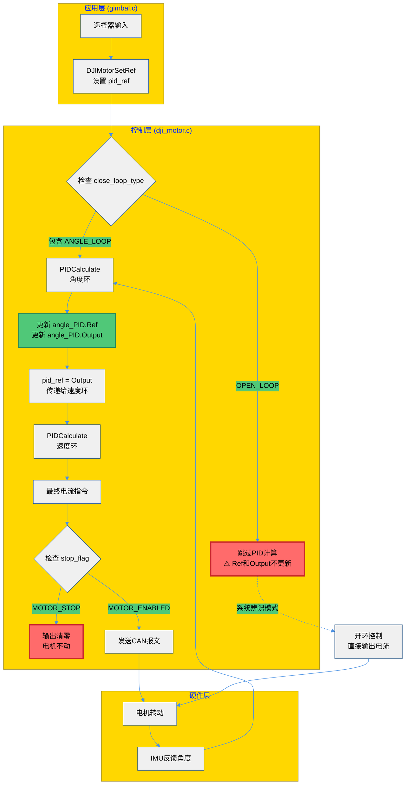

# PID变量停止更新原因分析

**日期：** 2025-10-10  
**问题：** 云台在动，但 `angle_PID.Ref` 和 `angle_PID.Output` 变量停下来

---

## 🎯 变量含义详解

### 1️⃣ `angle_PID.Ref` （角度环参考值）

```c
yaw_motor->motor_controller.angle_PID.Ref
```

**含义：** 你希望云台转到的目标角度

**更新位置：** 在 `PIDCalculate()` 函数内部更新
```c
// modules/algorithm/controller.c
float PIDCalculate(PIDInstance *pid, float measure, float ref) {
    pid->Ref = ref;          // 保存参考值
    pid->Measure = measure;  // 保存测量值
    pid->Err = ref - measure; // 计算误差
    
    // ... PID计算 ...
    
    pid->Output = Pout + Iout + Dout; // 保存输出
    return pid->Output;
}
```

**数据流：**
```
应用层设置
    ↓
DJIMotorSetRef(yaw_motor, 目标角度)
    ↓
motor_controller.pid_ref = 目标角度
    ↓
DJIMotorControl() 调用
    ↓
PIDCalculate(&angle_PID, IMU角度, pid_ref)
    ↓
angle_PID.Ref 被更新
```

### 2️⃣ `angle_PID.Output` （角度环输出）

**含义：** 角度PID计算后的结果，成为速度环的目标

**计算公式：**
```
Output = Pout + Iout + Dout
其中：
  Pout = Kp × 误差
  Iout = Ki × 积分累积
  Dout = Kd × 微分
```

---

## 🔍 变量"停下来"的3种原因

### ❌ 原因1：电机进入了 **系统辨识模式（SYSID）**

**现象：** 云台在动，但 `angle_PID` 不更新

**原因：** 
```c
// application/sysid/sysid_task.c:136
sysid_yaw_motor->motor_settings.close_loop_type = OPEN_LOOP;  // 改为开环
sysid_yaw_motor->motor_settings.outer_loop_type = OPEN_LOOP;
```

**解释：**
- 在系统辨识模式下，YAW轴被设为**开环控制**
- 开环模式下，直接发送电流指令，不计算PID
- 因此 `angle_PID.Ref` 和 `angle_PID.Output` 不再更新

**代码逻辑：**
```c
// modules/motor/DJImotor/dji_motor.c:257
// 只有在闭环类型包含ANGLE_LOOP时才计算角度PID
if ((motor_setting->close_loop_type & ANGLE_LOOP) && motor_setting->outer_loop_type == ANGLE_LOOP)
{
    pid_ref = PIDCalculate(&motor_controller->angle_PID, pid_measure, pid_ref);
}
// 如果是OPEN_LOOP，这段代码不执行，angle_PID不更新！
```

**判断方法：**
```c
// 在Ozone中监控：
yaw_motor->motor_settings.close_loop_type  // 如果是0（OPEN_LOOP），就是这个原因
yaw_motor->motor_settings.outer_loop_type  // 应该是4（ANGLE_LOOP）才正常
```

---

### ❌ 原因2：电机被 **停止（MOTOR_STOP）**

**现象：** 云台不动，PID变量也不更新

**原因：**
```c
// application/gimbal/gimbal.c:171-172
case GIMBAL_ZERO_FORCE: {
    DJIMotorStop(yaw_motor);  // 停止电机
    DJIMotorStop(pitch_motor);
    break;
}
```

**解释：**
- `DJIMotorStop()` 设置 `stop_flag = MOTOR_STOP`
- 虽然PID还在计算，但最终输出被清零
- 电机不响应任何控制

**代码逻辑：**
```c
// modules/motor/DJImotor/dji_motor.c:302-303
// 若该电机处于停止状态,直接将buff置零
if (motor->stop_flag == MOTOR_STOP)
    memset(sender_assignment[group].tx_buff + 2 * num, 0, sizeof(uint16_t));
```

**判断方法：**
```c
// 在Ozone中监控：
yaw_motor->stop_flag  // 0=MOTOR_STOP（停止），1=MOTOR_ENABLED（启用）
```

---

### ❌ 原因3：调试器问题 - **`yaw_motor` 是 static 变量**

**现象：** 变量在调试器中不可见或地址错误

**原因：**
```c
// application/gimbal/gimbal.c:24
static DJIMotorInstance *yaw_motor, *pitch_motor;  // static限定符
```

**解释：**
- `static` 关键字限制了变量的可见性
- 某些调试器可能无法正确解析static变量
- 你可能监控的是一个错误的地址或旧的值

**解决方案：**

**方案A：创建全局调试指针（推荐）**
```c
// 在 gimbal.c 顶部添加（非static）
volatile DJIMotorInstance *debug_yaw = NULL;
volatile DJIMotorInstance *debug_pitch = NULL;

// 在 GimbalInit() 中绑定
void GimbalInit() {
    // ... 电机初始化 ...
    yaw_motor = DJIMotorInit(&yaw_config);
    pitch_motor = DJIMotorInit(&pitch_config);
    
    // 绑定调试指针
    debug_yaw = yaw_motor;
    debug_pitch = pitch_motor;
}

// 在Ozone中监控：
debug_yaw->motor_controller.angle_PID.Ref
debug_yaw->motor_controller.angle_PID.Output
```

**方案B：移除static限定符**
```c
// 改为非static
DJIMotorInstance *yaw_motor, *pitch_motor;
```

---

## 📊 完整的控制流程图



---

## 🔧 诊断步骤

### 步骤1：确认电机状态
在Ozone中监控：
```c
yaw_motor->stop_flag
// 0 = MOTOR_STOP（停止）
// 1 = MOTOR_ENABLED（运行中）
```

### 步骤2：确认闭环类型
```c
yaw_motor->motor_settings.close_loop_type
// 0 = OPEN_LOOP（开环，不计算PID）
// 2 = SPEED_LOOP（速度环）
// 4 = ANGLE_LOOP（角度环）
// 6 = ANGLE_AND_SPEED_LOOP（双环串级）
```

### 步骤3：确认当前模式
```c
gimbal_cmd_recv.gimbal_mode
// 0 = GIMBAL_ZERO_FORCE（零力矩）
// 1 = GIMBAL_FREE_MODE（自由模式）
// 2 = GIMBAL_GYRO_MODE（陀螺仪模式，正常模式）
// 3 = GIMBAL_SYS_ID_CHIRP（系统辨识模式，PID不工作！）
```

### 步骤4：监控PID更新
同时监控这几个变量：
```c
yaw_motor->motor_controller.angle_PID.Ref      // 目标值
yaw_motor->motor_controller.angle_PID.Measure  // 实际值（IMU反馈）
yaw_motor->motor_controller.angle_PID.Err      // 误差
yaw_motor->motor_controller.angle_PID.Output   // 输出
yaw_motor->motor_controller.angle_PID.dt       // PID计算周期
```

如果 `dt = 0` 或长时间不变，说明PID没有在计算！

---

## 💡 典型场景分析

### 场景1：正常运行
```
close_loop_type = 6 (ANGLE_AND_SPEED_LOOP)
outer_loop_type = 4 (ANGLE_LOOP)
stop_flag = 1 (MOTOR_ENABLED)
gimbal_mode = 2 (GIMBAL_GYRO_MODE)

结果：angle_PID.Ref 和 Output 持续更新 ✅
```

### 场景2：系统辨识模式
```
close_loop_type = 0 (OPEN_LOOP)  ⚠️
outer_loop_type = 0 (OPEN_LOOP)  ⚠️
stop_flag = 1 (MOTOR_ENABLED)
gimbal_mode = 3 (GIMBAL_SYS_ID_CHIRP)

结果：angle_PID 不更新，但电机在动（开环控制）❌
```

### 场景3：电机停止
```
close_loop_type = 6 (ANGLE_AND_SPEED_LOOP)
outer_loop_type = 4 (ANGLE_LOOP)
stop_flag = 0 (MOTOR_STOP)  ⚠️
gimbal_mode = 0 (GIMBAL_ZERO_FORCE)

结果：PID可能还在计算，但输出被清零，电机不动 ❌
```

---

## 🎓 知识点总结

### 1. PID变量的更新时机
- `angle_PID.Ref` 和 `Output` 只在 `PIDCalculate()` 函数中更新
- `PIDCalculate()` 只在满足闭环条件时调用
- 开环模式下，PID完全不计算

### 2. 控制模式的区别
| 模式 | close_loop_type | PID工作 | 适用场景 |
|------|----------------|---------|---------|
| 开环 | OPEN_LOOP (0) | ❌ 不工作 | 系统辨识 |
| 速度环 | SPEED_LOOP (2) | 仅速度PID | 速度控制 |
| 角度环 | ANGLE_LOOP (4) | 仅角度PID | 位置控制 |
| 双环串级 | ANGLE_AND_SPEED_LOOP (6) | ✅ 全部工作 | 正常云台控制 |

### 3. static变量的调试问题
- `static` 变量只在当前文件可见
- 部分调试器无法直接访问static变量
- 解决方案：创建非static的全局调试指针

---

## ✅ 解决建议

### 如果是系统辨识模式导致：
1. 退出系统辨识模式，切换到 `GIMBAL_GYRO_MODE`
2. 或者在Ozone中监控开环控制的变量（电流指令）

### 如果是调试器问题：
1. 创建全局调试指针（见上方方案A）
2. 或移除static限定符

### 推荐的Ozone监控配置：
```
// 基础状态
yaw_motor->stop_flag
yaw_motor->motor_settings.close_loop_type
yaw_motor->motor_settings.outer_loop_type

// PID状态（仅在闭环模式有效）
yaw_motor->motor_controller.angle_PID.Ref
yaw_motor->motor_controller.angle_PID.Measure
yaw_motor->motor_controller.angle_PID.Err
yaw_motor->motor_controller.angle_PID.Output
yaw_motor->motor_controller.angle_PID.dt

// 速度环
yaw_motor->motor_controller.speed_PID.Output

// 最终输出
yaw_motor->measure.real_current
```

---

**文档生成时间：** 2025-10-10


