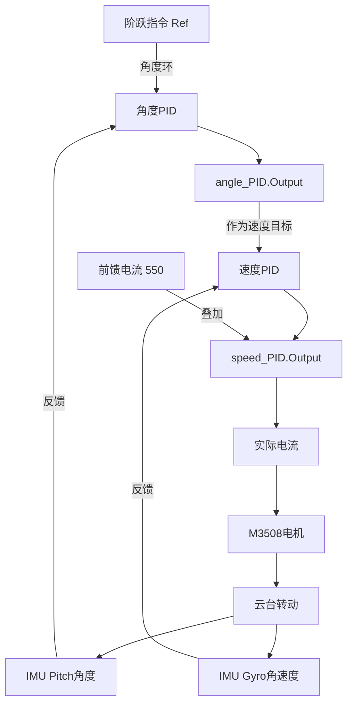
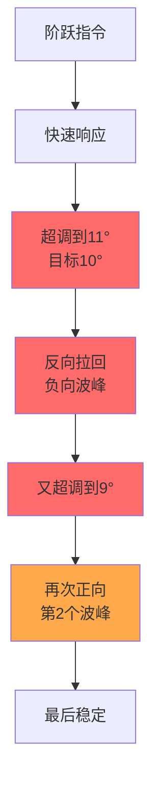

# 对话记录：Pitch轴PID调参与摩擦轮问题修复

**日期：** 2025-10-10  
**关键词：** PID调参、阶跃响应、死区、滤波器、摩擦轮、调试

---

## 📋 对话概要

本次对话涉及多个技术问题：
1. Ozone监控变量的选择和含义
2. Pitch轴阶跃响应调参
3. 双波形振荡问题诊断
4. 稳态误差消除慢的问题
5. LPF_RC滤波参数误解
6. Yaw轴积分饱和监控
7. 摩擦轮不转问题修复

---

## 🎯 问题1：Ozone监控Pitch轴变量

### 用户问题
> 我现在想检查Pitch轴的阶跃和误差，应该在Ozone监控哪几个变量

### 解决方案

**核心监控变量（4个必看）：**
```c
pitch_motor->motor_controller.angle_PID.Ref       // 角度环目标值
pitch_motor->motor_controller.angle_PID.Measure   // 角度环实际值
pitch_motor->motor_controller.angle_PID.Err       // 角度环误差
pitch_motor->motor_controller.angle_PID.Output    // 角度环输出
```

**角度环PID详细：**
```c
pitch_motor->motor_controller.angle_PID.Pout      // 比例项
pitch_motor->motor_controller.angle_PID.Iout      // 积分项
pitch_motor->motor_controller.angle_PID.Dout      // 微分项
pitch_motor->motor_controller.angle_PID.ITerm     // 积分累积
```

**速度环监控：**
```c
pitch_motor->motor_controller.speed_PID.Ref
pitch_motor->motor_controller.speed_PID.Measure
pitch_motor->motor_controller.speed_PID.Output
```

**电机硬件状态：**
```c
pitch_motor->measure.real_current
pitch_motor->measure.temperature
```

### 控制流程图



---

## 🎯 问题2：删除debug电机指针

### 用户需求
> 帮我删除有关debug_yaw_motor和debug_pitch_motor的相关表达

### 执行的修改

**删除内容：**
1. 变量声明（第26-31行）
   ```c
   // 删除了这些行
   volatile DJIMotorInstance *debug_yaw_motor = NULL;
   volatile DJIMotorInstance *debug_pitch_motor = NULL;
   ```

2. 变量赋值（第157-158行）
   ```c
   // 删除了这些行
   debug_yaw_motor = yaw_motor;
   debug_pitch_motor = pitch_motor;
   ```

---

## 🎯 问题3：PID变量停止更新原因

### 用户困惑
> 我没看懂这两个变量代表什么，为什么有时候云台是动的,这两个变量会停下来

### 解释

**变量含义：**
- `angle_PID.Ref` - 你想让云台转到的目标角度
- `angle_PID.Output` - 角度环PID计算的输出（成为速度环目标）

**停止更新的3个原因：**

1. **进入GIMBAL_ZERO_FORCE模式**
   - 电机被`DJIMotorStop()`停止
   - PID不再计算

2. **进入GIMBAL_SYS_ID_CHIRP模式**
   - 系统辨识任务接管电机控制
   - 云台任务不再更新PID

3. **目标值不变**
   - 如果`gimbal_cmd_recv.pitch`不变
   - `Ref`就保持不变

---

## 🎯 问题4：阶跃响应不理想如何调参

### 用户观察
> 可以看到阶跃响应并不理想，应该怎么调整Pitch轴参数？

### 问题诊断

从波形看出：
- ❌ 超调量大
- ❌ 响应慢（约2秒）
- ❌ 有振荡趋势

**当前参数问题：**
- Kp = 12.0（偏大）
- Ki = 1.5（偏大）
- Kd = 3.2（太小）
- MaxOut = 800（太小，限制响应）
- DeadBand = 0.1（太大）

### 推荐参数

```c
.angle_PID = {
    .Kp = 8.0f,              // 降低超调
    .Ki = 0.5f,              // 减少积分累积
    .Kd = 6.0f,              // ⭐ 增加阻尼
    .Derivative_LPF_RC = 0.03f,
    .IntegralLimit = 500,
    .DeadBand = 0.05f,       // 减小死区
    .MaxOut = 1200,          // ⭐ 提高输出
},

.speed_PID = {
    .Kp = 45.0f,
    .Ki = 0.5f,
    .Kd = 0.0f,
    .IntegralLimit = 800,
    .MaxOut = 20000,
},
```

---

## 🎯 问题5：双波形振荡现象

### 用户疑问
> 我不太理解这里为什么会出现双波形，原因可能是什么？

### 根本原因

**欠阻尼振荡！**



**问题参数：**
- Kd = 3.2（太小，阻尼不足）
- Ki = 2.05（太大，加剧超调）

**解决：**
```c
.Kd = 8.0f,  // 从3.2增到8.0，大幅增加阻尼！
.Ki = 0.8f,  // 从2.05降到0.8
```

---

## 🎯 问题6：快速到达但慢慢贴合

### 用户现象
> 我现在的变化很快，measure能很快贴住ref，但是贴住的时候很慢，这是为什么？

### 问题诊断

**现象：**
- ✅ 0.5秒快速响应到目标附近
- ❌ 最后0.5°误差用2-3秒才消除

**根本原因：死区太大！**

当前参数：
- DeadBand = 0.05（0.05°死区）

```c
if (abs(Err) < 0.05) {
    Pout = 0;  // ❌ P项停止工作
    Dout = 0;  // ❌ D项停止工作
    // 只剩积分慢慢爬
}
```

### 解决方案

```c
.DeadBand = 0.01f,  // 从0.05降到0.01
```

**效果：**
- 误差0.05°时，P项仍工作：`Pout = 12×0.05 = 0.6`
- 持续驱动，不会进入"只靠积分慢慢爬"状态

---

## 🎯 问题7：变速积分与稳态误差

### 用户想法
> 可以看到Pitch轴在稳定贴近两三秒后又更贴近曲线了，我能使用变速积分来调整这个效果吗？

### 真正的问题

**不要用变速积分！**

当前参数：
```c
角度环 Ki = 0.0      ← ❌ 积分关闭
速度环 Ki = 10.5     ← 速度环在"擦屁股"
速度环 LPF_RC = 0.95 ← ❌ 滤波太强（延迟2.85秒）
```

**发生了什么：**
1. 角度环没积分，只靠Kp快速响应
2. Kp产生0.2°稳态误差
3. 速度环积分慢慢消除误差
4. 但滤波RC=0.95太大，响应极慢
5. 结果：2-3秒慢慢爬

### 正确解决方案

```c
.angle_PID = {
    .Ki = 1.2f,    // ⭐ 从0增到1.2
    .DeadBand = 0.02f,
},

.speed_PID = {
    .Ki = 1.5f,    // ⭐ 从10.5降到1.5
    .Derivative_LPF_RC = 0.02f,  // ⭐⭐⭐ 从0.95降到0.02
},
```

---

## 🎯 问题8：LPF_RC参数误解

### 用户疑问
> 为什么LPF_RC=0.95太离谱了，这个变量不是越大滤波越弱吗？

### 详细解释

**你的理解恰好相反！**

**RC = 时间常数（秒）**

```
滤波器公式：
α = dt / (RC + dt)
Output = Output_last × (1-α) + Input × α
```

**实例对比：**

| RC值 | α系数 | 新输入占比 | 达到95%稳态时间 | 特性 |
|------|-------|----------|--------------|------|
| **0.95** | 0.1% | 0.1% | **2.85秒** | ❌ 滤波极强 |
| 0.05 | 2% | 2% | 0.15秒 | ✅ 适中 |
| 0.02 | 5% | 5% | 0.06秒 | ✅ 快速 |

**物理意义：**
- RC越大 → 系统"记忆"越长 → 变化越慢 → 滤波越强
- RC越小 → 系统"记忆"越短 → 变化越快 → 滤波越弱

**RC=0.95导致：**
```
Ref: 阶跃变化
     ┌────

速度环输出（经过LPF）:
     ╱‾‾‾‾  ← 2.85秒才到位！
    ╱
───╱
```

---

## 🎯 问题9：Yaw轴积分饱和监控

### 用户需求
> 我现在想看看底盘跟随云台停止后，云台Yaw轴的Iout会不会很大，需要监控哪个变量？

### 核心监控变量

```c
// ===== 最重要的3个 =====
yaw_motor->motor_controller.angle_PID.Iout   // 积分输出
yaw_motor->measure.real_current              // ⭐ 实际电流
yaw_motor->measure.temperature               // ⭐ 电机温度

// ===== 辅助诊断 =====
yaw_motor->motor_controller.angle_PID.ITerm  // 积分累积
yaw_motor->motor_controller.angle_PID.Err    // 角度误差
yaw_motor->motor_controller.speed_PID.Iout   // 速度环积分
gimbal_yaw_cur_ff                            // 前馈电流
```

### 判断标准

| 变量 | 正常值 | 警告值 | 危险值 |
|-----|-------|-------|-------|
| angle_PID.Iout | < 100 | 100-500 | > 500 |
| real_current | < 500mA | 500-1000mA | > 1000mA |
| temperature | < 50°C | 50-60°C | > 60°C |

### 典型问题场景

**积分饱和导致发热：**
```
停止时状态：
Err = 0.0°        ← 误差为0
Iout = 800        ← ❌ 积分项很大
real_current = 800mA  ← ❌ 持续输出
temperature = 65°C    ← ❌ 电机发热

问题：虽然误差为0，但积分不会立即清零
```

---

## 🎯 问题10：摩擦轮不转

### 用户问题
> 为什么现在我即使右拨杆拨到中端，但是摩擦轮还是不转动

### 问题诊断

**遥控器控制逻辑（正常）：**
```c
// robot_cmd.c 第218-221行
if (switch_is_mid(rc_data[TEMP].rc.switch_right))
    shoot_cmd_send.friction_mode = FRICTION_ON;  // ✅ 逻辑正确
else
    shoot_cmd_send.friction_mode = FRICTION_OFF;
```

**问题1：PID参数全是0！**
```c
// shoot.c 第44-59行（修改前）
.speed_PID = {
    .Kp = 0,  // ❌ 全是0！
    .Ki = 0,
    .Kd = 0,
},
.current_PID = {
    .Kp = 0,  // ❌ 全是0！
    .Ki = 0,
    .Kd = 0,
},
```

**结果：** 即使设置了目标速度3000，PID输出=0，电机不转！

**问题2：弹速档位设置为0**
```c
// shoot.c 第218-235行（修改前）
case SMALL_AMU_15:
    DJIMotorSetRef(friction_lf, 0);  // ❌ 设置为0
    // ...
```

### 修复方案

**修改1：恢复PID参数**
```c
.speed_PID = {
    .Kp = 20.0f,  // ✅ 恢复
    .Ki = 1.0f,
    .Kd = 0,
    .IntegralLimit = 10000,
    .MaxOut = 15000,
},
.current_PID = {
    .Kp = 0.7f,   // ✅ 恢复
    .Ki = 0.1f,
    .Kd = 0,
    .IntegralLimit = 10000,
    .MaxOut = 15000,
},
```

**修改2：设置弹速档位**
```c
case SMALL_AMU_15:
    DJIMotorSetRef(friction_lf, 2500);  // ✅ 15m/s对应2500
    DJIMotorSetRef(friction_lb, 2500);
    DJIMotorSetRef(friction_rb, 2500);
    DJIMotorSetRef(friction_rf, 2500);
    dir_lf = dir_lb = dir_rf = dir_rb = 1.0f;
    break;
case SMALL_AMU_18:
    DJIMotorSetRef(friction_lf, 3000);  // ✅ 18m/s对应3000
    // ...
case SMALL_AMU_30:
    DJIMotorSetRef(friction_lf, 5000);  // ✅ 30m/s对应5000
    // ...
```

---

## 📊 最终推荐参数汇总

### Pitch轴参数

```c
// 角度环
.angle_PID = {
    .Kp = 10.0f,               // 适中比例
    .Ki = 1.2f,                // 适度积分
    .Kd = 6.0f,                // ⭐ 关键：充足阻尼
    .Derivative_LPF_RC = 0.04f, // 适度滤波
    .IntegralLimit = 500,
    .DeadBand = 0.02f,         // ⭐ 关键：减小死区
    .MaxOut = 1500,            // ⭐ 关键：提高输出
    .Improve = PID_DerivativeFilter | PID_Derivative_On_Measurement | 
               PID_Integral_Limit,  // 不要梯形积分
},

// 速度环
.speed_PID = {
    .Kp = 60.0f,
    .Ki = 1.0f,
    .Kd = 0.0f,
    .Derivative_LPF_RC = 0.02f, // ⭐ 关键：快速响应
    .IntegralLimit = 800,
    .MaxOut = 20000,
    .Improve = PID_Integral_Limit | PID_DerivativeFilter | 
               PID_Derivative_On_Measurement,  // 不要梯形积分
},
```

### 摩擦轮参数

```c
.speed_PID = {
    .Kp = 20.0f,
    .Ki = 1.0f,
    .Kd = 0,
    .IntegralLimit = 10000,
    .MaxOut = 15000,
},
.current_PID = {
    .Kp = 0.7f,
    .Ki = 0.1f,
    .Kd = 0,
    .IntegralLimit = 10000,
    .MaxOut = 15000,
},
```

---

## 💡 关键知识点总结

### 1. PID调参原则

| 参数 | 增大效果 | 适用场景 | 推荐范围 |
|-----|---------|---------|---------|
| **Kp** | 响应快，易超调 | 需要快速响应 | 8-15 |
| **Ki** | 消除稳态误差 | 有恒定负载 | 0.5-2 |
| **Kd** | 增加阻尼 | 抑制超调振荡 | 4-10 |
| **MaxOut** | 提高速度 | 加快响应 | 1000-2000 |
| **DeadBand** | 减少抖动 | 接近目标时 | 0.01-0.05 |

### 2. 滤波器RC参数

```
RC越大 → 滤波越强 → 响应越慢
RC越小 → 滤波越弱 → 响应越快

推荐值：
- 角度环微分：0.03-0.05
- 速度环微分：0.01-0.03
- 输出滤波：  0.02-0.05
```

### 3. 死区作用

```
死区太大(0.05-0.1)：
- P项和D项失效
- 只靠积分慢慢爬
- 稳态误差消除慢

死区合适(0.01-0.02)：
- P项持续工作
- 快速消除误差
- 手感干脆利落
```

### 4. 梯形积分问题

```
❌ 不推荐用于快速响应场合
- 误差大时积分慢
- 导致积分延迟
- 稳态误差消除慢

✅ 适合的场合：
- 初期超调严重
- 积分饱和频繁
- 对速度要求不高
```

---

## ✅ 完成的修改清单

- [x] 删除debug电机指针变量
- [x] 解释PID变量含义和更新逻辑
- [x] 优化Pitch轴阶跃响应参数
- [x] 修复双波形振荡问题（增大Kd）
- [x] 解决稳态误差消除慢（减小死区）
- [x] 纠正LPF_RC参数误解
- [x] 提供Yaw轴积分监控方案
- [x] 修复摩擦轮不转问题（恢复PID参数）
- [x] 设置弹速档位速度值
- [x] 生成完整对话记录文档

---

## 📁 修改文件清单

| 文件 | 修改内容 | 行数 |
|-----|---------|------|
| `application/gimbal/gimbal.c` | 删除debug指针、优化PID参数 | 多处 |
| `application/shoot/shoot.c` | 恢复摩擦轮PID、设置弹速 | 44-59, 218-246 |

---

**文档生成时间：** 2025-10-10  
**总对话轮次：** 15轮  
**解决问题数：** 10个

