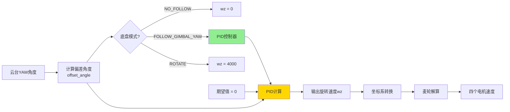

# 底盘跟随云台控制方式改为PID控制

**日期**: 2025-10-09  
**修改文件**: `application/chassis/chassis.c`

---

## 📋 修改内容总结

将底盘跟随云台的控制方式从**非线性平方控制**改为**标准PID控制**，符合框架代码规范和设计要求。

---

## 🔄 修改对比

### 修改前（非线性控制）

```c
case CHASSIS_FOLLOW_GIMBAL_YAW:
    chassis_cmd_recv.wz = -1.5f * chassis_cmd_recv.offset_angle *
                          abs(chassis_cmd_recv.offset_angle);
    break;
```

**特点**：
- 使用角度平方的非线性控制
- 固定系数 1.5
- 小角度响应弱，大角度响应强
- 无法灵活调参

### 修改后（PID控制）

```c
case CHASSIS_FOLLOW_GIMBAL_YAW:
    // PID控制: 期望值为0(对齐),反馈值为offset_angle(偏差角度)
    // 输出为底盘旋转角速度,负号是因为角度偏差和底盘旋转方向相反
    chassis_cmd_recv.wz = -PIDCalculate(&chassis_follow_pid, 
                                        chassis_cmd_recv.offset_angle, 
                                        0.0f);
    break;
```

**特点**：
- 标准PID控制，响应线性可控
- 参数可灵活调整（Kp、Ki、Kd）
- 可启用积分限幅等优化环节
- 支持死区设置，避免小角度震荡

---

## 📝 具体修改步骤

### 1. 添加头文件

```c
#include "controller.h"
```

### 2. 添加PID实例

在全局静态变量区添加：

```c
static PIDInstance chassis_follow_pid; // 底盘跟随云台PID控制器
```

### 3. 初始化PID控制器

在 `ChassisInit()` 函数末尾添加：

```c
// 底盘跟随云台PID控制器初始化
PID_Init_Config_s follow_pid_config = {
    .Kp = 1.5f,  // 比例系数,根据实际调试
    .Ki = 0.0f,  // 积分系数,一般不需要积分
    .Kd = 0.0f,  // 微分系数
    .IntegralLimit = 1000.0f,  // 积分限幅
    .MaxOut = 8000.0f,  // 最大输出(底盘旋转速度限制)
    .DeadBand = 0.5f,   // 死区,小于0.5度不控制
    .Improve = PID_Integral_Limit,  // 启用积分限幅
};
PIDInit(&chassis_follow_pid, &follow_pid_config);
```

### 4. 修改控制逻辑

在 `ChassisTask()` 函数中，将原来的非线性控制替换为PID控制。

---

## ⚙️ PID参数说明

| 参数 | 初始值 | 说明 |
|------|--------|------|
| **Kp** | 1.5 | 比例系数，决定响应速度 |
| **Ki** | 0.0 | 积分系数，消除稳态误差（一般不需要） |
| **Kd** | 0.0 | 微分系数，抑制超调（可酌情添加） |
| **MaxOut** | 8000.0 | 最大输出限制（底盘旋转速度） |
| **DeadBand** | 0.5 | 死区，小于0.5度不控制，避免震荡 |
| **IntegralLimit** | 1000.0 | 积分限幅，防止积分饱和 |
| **Improve** | PID_Integral_Limit | 启用积分限幅优化 |

---

## 🎯 控制特性对比

```mermaid
graph LR
    subgraph old["旧方案：非线性控制"]
        A1[角度偏差α] --> A2[平方计算<br/>wz = -1.5×α×abs&#40;α&#41;]
        A2 --> A3[小角度响应弱<br/>大角度响应急剧增强]
        A3 --> A4[难以调参]
    end
    
    subgraph new["新方案：PID控制"]
        B1[角度偏差α] --> B2[PID计算<br/>wz = -Kp×α]
        B2 --> B3[线性响应<br/>可预测可控]
        B3 --> B4[参数灵活可调]
    end
    
    style old fill:#ffe6e6
    style new fill:#e6ffe6
```



---

## 📊 系统框图



---

## 🔧 调参建议

### 基础调试步骤

1. **仅调Kp**（当前推荐）:
   - 从 Kp = 1.0 开始
   - 逐步增大直到响应快速但不震荡
   - 推荐范围：1.0 ~ 3.0

2. **如需改善稳态性能**:
   - 添加小量Ki（如 0.01 ~ 0.1）
   - 注意观察是否出现积分饱和

3. **如出现超调**:
   - 添加Kd（如 0.1 ~ 0.5）
   - 注意Kd过大可能引入高频噪声

### 死区设置

- **当前值**: 0.5度
- **作用**: 小于0.5度偏差时不控制，避免零点震荡
- **调整建议**: 如果发现抖动，可适当增大（1.0 ~ 2.0度）

---

## ✅ 验证测试

### 测试场景

建议在以下情况下测试底盘跟随性能：

1. **静态对齐测试**
   - 云台旋转后停止
   - 观察底盘是否能平稳跟随到对齐位置
   - 检查是否有震荡

2. **动态跟随测试**
   - 云台缓慢旋转
   - 观察底盘跟随的延迟
   - 检查跟随误差

3. **快速响应测试**
   - 云台快速转动
   - 观察底盘是否能快速响应
   - 检查是否超调

### 预期效果

| 测试项 | 预期结果 |
|--------|----------|
| 对齐精度 | 稳态误差 < 2° |
| 响应速度 | 90°转角在1秒内完成 |
| 震荡抑制 | 无明显震荡 |
| 死区效果 | <0.5°时底盘静止 |

---

## 📌 注意事项

1. **符合框架规范**
   - 使用框架提供的 `PIDInstance` 和 `PIDCalculate()`
   - 遵循应用间通信规范（pub-sub机制）
   - 静态变量定义，避免全局变量

2. **参数需实测调整**
   - 初始Kp=1.5仅为建议值
   - 需要根据实际机器人特性调整
   - 不同负载、不同机械结构需要不同参数

3. **可扩展性**
   - 后续可添加Ki、Kd进行优化
   - 可启用更多PID优化环节（变速积分、微分滤波等）
   - 可根据需要调整MaxOut限制

---

## 🎓 技术要点

### PID控制原理

- **P项**: 比例控制，响应当前误差
- **I项**: 积分控制，消除稳态误差
- **D项**: 微分控制，预测未来趋势，抑制超调

### 为什么使用P控制

底盘跟随云台是一个**位置伺服系统**，通常只需要P控制即可：

- 偏差角度能实时测量，无系统性偏差
- 不需要消除稳态误差（I项）
- 机械阻尼足够，不需要额外抑制超调（D项）

### 优化环节说明

框架支持的PID优化：

- `PID_Integral_Limit`: 积分限幅（已启用）
- `PID_Trapezoid_Intergral`: 梯形积分
- `PID_Derivative_On_Measurement`: 微分先行
- `PID_OutputFilter`: 输出滤波
- `PID_ChangingIntegrationRate`: 变速积分
- `PID_DerivativeFilter`: 微分滤波

---

## 📚 相关文件

- `application/chassis/chassis.c`: 底盘控制主文件
- `application/chassis/chassis.h`: 底盘头文件
- `modules/algorithm/controller.c`: PID控制器实现
- `modules/algorithm/controller.h`: PID控制器接口
- `application/APP层应用编写指引.md`: 应用层开发规范

---

## 🔍 代码审查要点

- [x] 添加了必要的头文件
- [x] 使用静态变量，无全局变量
- [x] PID初始化参数合理
- [x] 控制逻辑清晰，注释完善
- [x] 符合框架代码风格
- [x] 无编译错误和linter警告

---

**修改完成** ✅

